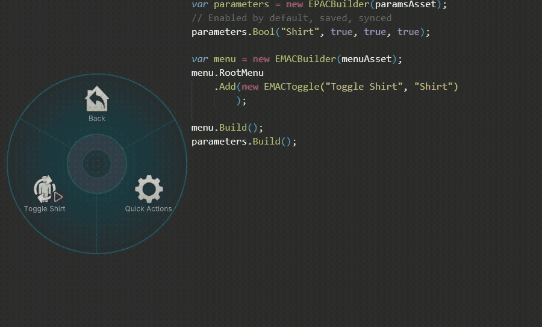

# Expression Menu As Code
Easily generate expression menus and and parameter lists with code.  

## Install
Add my VCC repo (https://kaoruboy.github.io/vcc) or download the .unitypackage from [the Releases page](https://github.com/KaoruBoy/VRC-Expression-Menu-As-Code/releases).

## Examples
Example code is located in the [Examples directory](Examples/).  

## Overview
This library allows you to generate Expression Menus and Parameters using code. Intended to be used in combination with [Animator As Code](https://github.com/hai-vr/av3-animator-as-code) but will work without it.  
To use this library, you must first create Expression Menu and Expression Parameter assets to which the data will be saved to. These assets must be saved to a path.  
The main classes in this library are `EMAC.EMACBuilder` for menus and `EPAC.EPACBuilder` for parameters. To use them, create an instance of these classes with the asset you want to save the data to. Unlike with AAC, the data is only saved when you call `.Build()`. When saving, all data in the assets will be removed.  
Both classes may define a parameter prefix using `.WithPrefix()` they will use when `.Build()` is called.  

### Expression Menus
The `EMAC.EMACBuilder` class is used to generate Expression Menus. It contains a `RootMenu` property, which holds the list of menu items. You can add items to the menu by calling `.Add()` with an instance of a menu item on `RootMenu`.  
All menu items have an action parameter, which is set to a given value when user performs an action. The action varies depending on the item type. Parameter name and value may be set using `.WithActionParameter()`.
Some menu items may set multiple parameters using different actions.  
Every item may define a custom icon (usually optional constructor parameter). If it's not defined, it will use the default icon defined by it's parent menu using `.WithDefaultItemIcon()` (`.WithDefaultFolderIcon()` for menus). If parent menu doesn't define one, it will inherit one from it's parent. If no parent defines a default icon, `EMACBuilder`'s default icon will be used.  
Menus use a separate icon from other types of items.  
This behavior also applies for paging settings.  

The following menu items are supported:
* **EMACMenu**
    Contains additional menu items.  
    If children count exceeds the item page limit (default: 8), it will automatically create additional submenus. See [Automatic Paging](#Automatic-Paging).  
    When opened, action parameter is set.  
* **EMACButton**  
    When hovered, sets the action parameter.  
* **EMACToggle**  
    When hovered, toggles the value of the action parameter.  
* **EMACRadial**  
    Sets the value of a float parameter equal to the clockwise rotation between 0.0 and 1.0.
    When opened, action parameter is set.  
* **EMACTwoAxisPuppet**  
    Sets the value of 2 float parameters to the direction the joystick is pushed. Values range from -1.0 to 1.0.  
    May define custom icons and labels for 4 directions using `.WithDirectionalIcons()` and `.WithDirectionalLabels()`.  
    When opened, action parameter is set.  
* **EMACFourAxisPuppet**  
    Similar to EMACTwoAxisPuppet, except it sets 4 float parameters. Parameters mapped to opposing directions get set to 0.0. Values range from 0.0 to 1.0.  
    When opened, action parameter is set.  

### Sample Icons
VRChat Avatar SDK includes sample icons to be used in expression menus. You can eaisly access them using the `EMAC.SampleIcons` class.   

### Automatic Paging
If a menu has more children than the set item page limit, a new submenu will be created with the remaining items. The max amount of items per page may be changed using `.WithMaxItemsPerPage()`.  
The generated submenus may be padded with dummy items to make the item positions consistent using `.WithPadding(true)`.  
Icon and label for the "Next Page" submenu and the icon for the padding items may be changed using `.WithNextPageIcon()` and `.WithNextPageText()`.

### Parameter List
The `EPAC.EPACBuilder` class is used to generate Expression Parameters.  
To add new parameters, call the `.Bool()`, `.Float()`, `.Int()` methods.  
The first parameter is the default value, 2nd defines if the parameter should be saved between avatar loads and 3rd defines if the parameter should be synchronized to other players (Optional, defaults to true).  